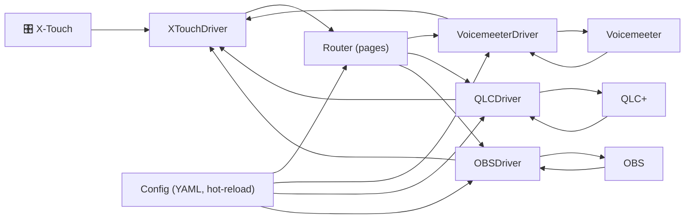

# XTouch GW

Passerelle Node.js/TypeScript pour piloter Voicemeeter, QLC+ et OBS depuis un Behringer X‑Touch (MIDI DIN).

### Pourquoi une gateway ?
- Unifier plusieurs applications sous une seule surface de contrôle (X‑Touch), sans reconfigurer chaque appli.
- Profiter d’une synchro bidirectionnelle fiable (faders motorisés, LEDs, LCD) avec snapshot au boot et à chaque changement de page.
- Structurer les usages par « pages » pour basculer instantanément entre des profils (son, lumières, régie vidéo).
- Acheminer et transformer le MIDI au besoin (bridges/passthroughs, PitchBend → CC/Note pour compat QLC+).
- Déployer une config simple en YAML avec hot‑reload et outils de debug (CLI + sniffer).

L’app gère notamment:

- Système de pages: définissez plusieurs pages de mapping et passez de l’une à l’autre depuis la X‑Touch. Par défaut, deux notes MIDI (46=précédent, 47=suivant) sur un canal configurable déclenchent le changement de page.
- Bridges MIDI par page (passthroughs) et bridge global Voicemeeter
- Feedback vers la surface (faders motorisés, LCD, LEDs) et labels LCD
- CLI de développement (learn/sniffer/fader/lcd) et Sniffer Web MIDI

### Aperçu de l’architecture (Mermaid)



Diagrammes détaillés dans [`docs/specifications.md`](docs/specifications.md).

## Prérequis
- Node.js >= 24.1
- pnpm (via Corepack)

## Installation
```sh
corepack enable
pnpm install
```

## Démarrage
```sh
pnpm dev         # lancement en développement (tsx watch)
pnpm build       # transpile TypeScript → dist/
pnpm start       # exécute dist/index.js
pnpm test        # tests unitaires (Vitest) + couverture
pnpm test:watch  # tests en mode watch
```

Pour activer des logs détaillés (PowerShell):
```powershell
$env:LOG_LEVEL="debug"; pnpm dev
```

## Configuration (config.yaml)

Fichier lu au démarrage, avec hot‑reload. Exemple réaliste aligné sur le code actuel:

```yaml
midi:
  input_port: "UM-One"
  output_port: "UM-One"

features:
  vm_sync: true   # aligne les faders sur Voicemeeter (snapshot + dirty loop)

paging:
  channel: 1      # canal NoteOn pour la navigation
  prev_note: 46   # page précédente
  next_note: 47   # page suivante

pages:
  - name: "Voicemeeter+QLC"
    lcd:
      labels:     # 8 scribble strips (0..7). Supporte "\n" pour 2 lignes.
        - "Mic\nBaba"
        - "Mic\nMath"
        - "Mic\nJu"
        - "Son\nMac"
        - "Son\nPC"
        - "Son\nMASTER"
        - "Son\nRetours"
        - "Lum\nFace"
    passthroughs:
      - driver: "midi"
        to_port: "xtouch-gw"
        from_port: "xtouch-gw-feedback"
        filter:
          channels: [1,2,3,4,5,6,7]
          types: ["noteOn","noteOff","controlChange","pitchBend"]
          includeNotes: [0,8,16,24]
      - driver: "midi"
        to_port: "qlc-in"
        from_port: "qlc-out"
        filter:
          channels: [8,9]
          types: ["noteOn","noteOff","controlChange","pitchBend"]
        transform:
          pb_to_cc:
            target_channel: 1
            base_cc: "0x45"   # ch1→0x46, ch2→0x47, …
    controls: {}              # mappings (router) – optionnels à ce stade

  - name: "Default"
    controls: {}
```

Comportement:
- Si au moins une page définit `passthrough`/`passthroughs`, le mode passthrough par page est actif. À chaque changement de page, les bridges de la page sont (ré)ouverts.
- Sinon, un bridge global X‑Touch ⇄ Voicemeeter est activé automatiquement (`xtouch-gw`/`xtouch-gw-feedback`).
- Si `features.vm_sync` est actif, un snapshot faders Voicemeeter est appliqué au boot et à chaque changement de page, puis une boucle « dirty » maintient la synchro.

## Pages, LCD et navigation
- Navigation entre pages via NoteOn sur `paging.channel` (par défaut ch=1) avec `prev_note` (46) et `next_note` (47).
- Labels LCD par page via `pages[].lcd.labels`:
  - soit une chaîne avec saut de ligne `upper\nlower`
  - soit un objet `{ upper, lower }`
- Si aucun label n’est fourni, le nom de la page est affiché en haut du strip 0.

## CLI de développement
La CLI se lance avec l’application et offre:
- `pages`, `page <idx|name>`
- `emit <controlId> [value]`
- `midi-ports`, `midi-open <idx|name>`, `midi-close`
- `learn <id>` (propose un `controlId` et une ligne YAML)
- `fader <ch> <0..16383>` (moteur)
- `lcd <strip0-7> <upper> [lower]`

Détails et workflow anti‑conflits de ports dans `docs/CLI.md`.

## Sniffer Web MIDI (navigateur)
```sh
pnpm sniff:web
```
Ouvre ensuite `http://localhost:8123/` pour voir les messages MIDI en hex avec Δ temps.

## Journaux
- Variable `LOG_LEVEL`: `error | warn | info | debug | trace`.
- Exemple (PowerShell):
  ```powershell
  $env:LOG_LEVEL="debug"; pnpm dev
  ```

## Dépannage rapide
- Après des changements de logique, redémarrer le process (ou rebuild) pour éviter un ancien comportement chargé en mémoire.
- En cas de boucle MIDI (loopMIDI en sécurité), couper un des ponts/bridges, vérifier les filtres, puis redémarrer les ports.
- Vérifier les noms de ports `midi.input_port` / `midi.output_port` et les ports des bridges.

## Licence
MPL-2.0 (Mozilla Public License 2.0)