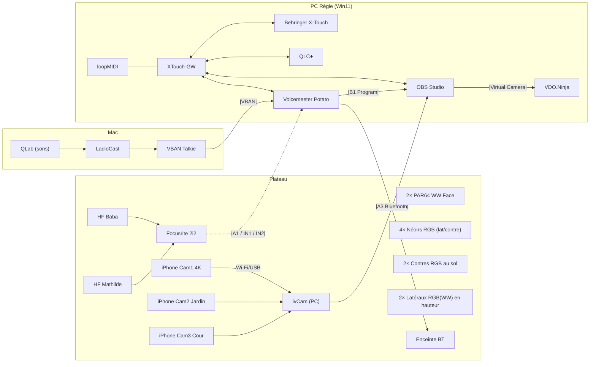

Parfait — j’intègre tes demandes : **Virtual Camera OBS à lancer**, **schéma mermaid**, **checklists à cocher**, **mise en forme plus lisible (flèches/bullets)**. Voici la doc révisée.

# Régie Twitch — La Scène AVOLO (mode opératoire)

## 1) Architecture (résumé rapide)

* **PC (Win11)** → `OBS + Voicemeeter Potato + QLC+ + XTouch-GW + ivCam + loopMIDI + VDO.Ninja`
  Contrôleurs : **Behringer X-Touch** (surface), **StreamDeck** (raccourcis).
* **Mac** → `QLab + LadioCast + VBAN Talkie Cherry` → envoi **audio VBAN** vers PC.
  Sortie/contrôle local : **Behringer Xenyx 502** (retour casque + niveau).
* **Plateau** → `3 iPhones (ivCam), 2×PAR64 WW Face, néons RGB (latéraux/contres), contres RGB au sol, latéraux RGB(WW) en hauteur, enceinte BT, 2 micros HF`.

### Points clefs

* **Vidéo** : OBS → scènes “cams” (+ crops sur Cam1 4K). **VPOT 6/7/8** de la X-Touch pilotent **X / Y / Zoom** des crops.
* **Audio** : mix Voicemeeter → **B1 vers OBS** (programme). **Mac → PC** via **VBAN** (stable, bufferisable).
* **Lumière** : QLC+ piloté en **MIDI** (X-Touch-GW) sur **Console Virtuelle** (onglets “Néons”, “Latéraux”).
* **Diff** : **OBS Virtual Camera → VDO.Ninja** (⚠️ à lancer avant le live).

---

## 2) Schéma général (mermaid)



---

## 3) Flux & réglages essentiels

### 3.1 Vidéo (OBS)

* **Scènes** : une scène = une caméra (Cam1 4K + **4 crops** mémorisés).
* **Contrôle live crops** :

  * **VPOT6** → **nudgeX** (X), **VPOT7** → **nudgeY** (Y), **VPOT8** → **scaleUniform** (Zoom).
* **Réglages ivCam (iPhones)** → *Expo 150*, *ISO 150*, *Comp 0*, *WB 3500K*, *Focus auto*.
* **Studio Mode** :

  * **OFF** → changement direct **Program**.
  * **ON** → commandes X-Touch/StreamDeck pilotent **Preview** + **Transition**.
* **Diffusion vers VDO.Ninja** → **OBS Virtual Camera** **(à lancer)** → choisir “OBS Virtual Camera” dans VDO.Ninja.

### 3.2 Audio (Voicemeeter)

* **Entrées**

  * **IN1** = A1 ASIO **L** (Focusrite) → **HF Baba** (*mono*, **Comp 6.2 / Gate 1.0 / Denoise 0.5**)
  * **IN2** = A1 ASIO **R** (Focusrite) → **HF Mathilde** (*mono*, **Comp 6.2 / Gate 1.0 / Denoise 0.5**)
  * **IN3** = **Micro PC (DAC USB Logitech)** (*mono*, **Comp 4.7 / Gate 3.1 / Denoise 2.8**)
* **Virtuelles**

  * **VA1** = Son PC
  * **VA2** = **Son Mac via VBAN**
* **Sorties**

  * **A1** = Focusrite (retour casque possible)
  * **A2** = Casque Logitech (monitoring)
  * **A3** = Enceinte Bluetooth (retours)
  * **B1** = **vers OBS** (programme)
* **Système** : 48 kHz / buffer 256. Si BT utilisé → **Delay \~200 ms** sur A1 pour recaler.

### 3.3 Audio réseau (Mac → PC)

* **Mac** : `QLab → LadioCast → VBAN Talkie (2ch)` ; niveau global via **Xenyx 502** (retour casque + potard).
* **PC** : **Voicemeeter VBAN IN “Mac”** **actif** (port **6980**) → **assigné à une entrée** (ex. IN6).
* **Pourquoi VBAN** : bien plus stable que NDI audio (buffers + jitter tolerant).

### 3.4 Lumière (QLC+)

* **Console Virtuelle** : onglets **Néons / Latéraux** (boutons couleurs/presets), faders **dimmers** dédiés.
* **Pilotage** : X-Touch via **XTouch-GW** (MIDI in/out), feedback sur faders motorisés.

---

## 4) Contrôles & mappings (extraits utiles)

### X-Touch ↔ Voicemeeter (midi map `xtouch-native`)

* **Faders entrées** : `E0..E3` → **InGainFader1..4**
* **Fader VA1** : `E4` → **VInGainFader1**
* **Master (B1/Program)** : `E5` → **VOutGainFader1**
* **Bus A2 (casque)** : `E6` → **OutGainFader2**
* **Mutes** : notes dédiées (LED feedback) sur entrées/bus/virtual (selon map).

### X-Touch ↔ OBS (config.yaml)

* **VPOT6/7/8** → `nudgeX / nudgeY / scaleUniform` sur scènes **--- CAM Main** (crop).
* **Assign buttons** → changement rapide de scènes (`--- CAM Main`, `--- CAM Main 2`, `--- CAM Jardin`, `--- CAM Cour`, `--- Blur`).
* **Global View** → `toggleStudioMode` ; **Play** → `TriggerStudioModeTransition`.

### X-Touch ↔ QLC+ (config.yaml)

* **Fader master** QLC → **CC ch.1 / CC 78**.
* Boutons/notes → déclenchement presets de la **Virtual Console**.

### loopMIDI (ports logiques)

* **qlc** : `output_port: qlc-in`, `input_port: qlc-out`
* **voicemeeter** : `output_port: xtouch-gw`, `input_port: xtouch-gw-feedback`

---

## 5) Checklists d’exploitation (à cocher)

### A. Pré-live (≈2 min)

* [ ] **OBS Virtual Camera** → **ON** (source pour VDO.Ninja)
* [ ] **iPhones** branchés, ivCam lancé, **Expo 150 / ISO 150 / Comp 0 / WB 3500K / Focus auto**, écran non-verrouillable
* [ ] **Voicemeeter** : A1=Focusrite 48k/256 ; IN1/IN2 en *mono* ; comp/gate/denoise OK
* [ ] **VBAN** : **IN “Mac” actif**, port 6980, assigné à l’entrée prévue (ex. IN6)
* [ ] **OBS** : scènes prêtes (Carton, Intro, Pause/Blur, Cam3+Chat, Partage PC+Cam1), **source audio = B1**
* [ ] **QLC+** : console virtuelle ouverte (onglets **Néons/Latéraux**, dimmers visibles)
* [ ] **X-Touch-GW** démarré (moteurs bougent au **sendInitialFeedback**), **StreamDeck** en ligne
* [ ] **Retours** : A2 casque OK ; A3 BT OK (si BT, **Delay A1 \~200 ms** si besoin)
* [ ] **HF** : niveaux propres (pas de clip), **anti-larsen** OK

### B. Lancement

* [ ] **Carton “On arrive”** → **Intro** → **Cam1 / crop**
* [ ] **Musique/FX** via **QLab (Mac)**, niveau sur **Xenyx 502** → VBAN → VA2
* [ ] **Lumières** via **QLC+** : presets **Néons/Latéraux**, ajuster dimmers

### C. Pendant le live

* [ ] Changement de plans au **StreamDeck**/**X-Touch**
* [ ] Ajuster **crops** (VPOT 6/7/8) si besoin
* [ ] Monitoring **A2** ; si réseau instable, basculer musique sur source **locale PC** (Artlist/Spotify)

### D. Fin de live

* [ ] **Pause / Blur** → **Outro** → **Stop stream**
* [ ] Stop **VBAN Talkie** (Mac), **OBS (Virtual Cam OFF)**, **Voicemeeter** (sauver preset), **QLC+**, **X-Touch-GW**

---

## 6) Dépannage express

* **Audio qui hache (Mac→PC)** → vérifier **VBAN IN “Mac” actif** (IP/port), **NQ/buffers**, éviter Wi-Fi faible ; VBAN > NDI pour l’audio.
* **Pas de moteurs/LED X-Touch** → recharger **midi map `xtouch-native`** dans Voicemeeter, vérifier ports loopMIDI et que la GW n’est pas en *dry-run*.
* **Décalage BT** → **Delay \~200 ms** sur A1.
* **QLC+ inerte** → Virtual Console au premier plan + port MIDI correct ; relancer QLC+ si besoin.

---

Si tu veux, je peux te générer une **version “print A4”** (1 page) avec uniquement les **checklists** et un **mini-schéma**.

## 🎛️ Tests X-Touch disponibles

### 1. **Tests unitaires de l'API X-Touch**
```bash
pnpm test src/xtouch/_tests/api.test.ts
```

Ces tests couvrent :
- Encodage des messages MIDI (Note On, Control Change, Pitch Bend)
- Fonctions de reset des faders
- Gestion des LEDs et boutons
- Affichage LCD et 7-segments
- Fonctions utilitaires

### 2. **Tests d'intégration MidiBridge (avec X-Touch simulé)**
```bash
pnpm test src/drivers/_tests/midiBridge.test.ts
```

Ces tests simulent l'interaction entre la X-Touch et les applications externes.

### 3. **Test MIDI complet (avec matériel réel)**
```bash
<code_block_to_apply_changes_from>
```

Ce test utilise le vrai matériel X-Touch pour valider l'ensemble du pipeline.

## 🚀 Commandes recommandées

### Pour les tests X-Touch uniquement :
```bash
# Tests unitaires API X-Touch
pnpm test src/xtouch/_tests/

# Tests d'intégration avec X-Touch simulé
pnpm test src/drivers/_tests/midiBridge.test.ts

# Test complet avec matériel (si connecté)
pnpm test:midi
```

### Pour tous les tests (recommandé) :
```bash
# Mode watch pour développement
pnpm test:watch

# Tests complets avec couverture
pnpm test
```

## 📊 État actuel des tests X-Touch

D'après l'audit des tests, les tests X-Touch sont bien couverts :
- ✅ **API primitives** : Messages MIDI, LCD, 7-segments
- ✅ **Intégration** : MidiBridge avec X-Touch simulé
- ✅ **Test matériel** : Pipeline complet avec vrai matériel

Voulez-vous que je lance un test spécifique pour voir l'état actuel ?
