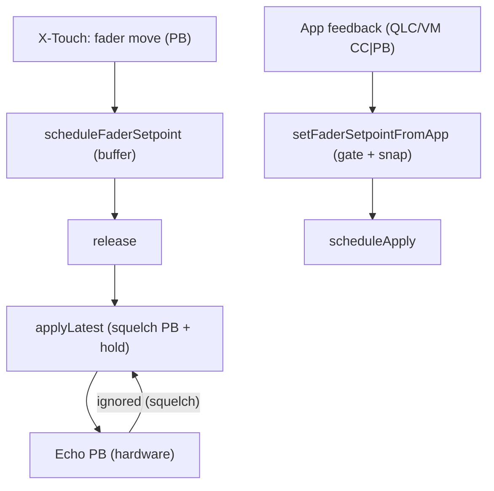

# Bug fader: descente légère après butée (100%)

## Contexte
- **Symptôme**: en montant un fader à 100% (PB=16383), la X‑Touch redescend légèrement (≈16380..16381).
- **Impact**: la valeur envoyée à l’app (VM/QLC) reste correcte, mais la surface (X‑Touch) se décale visuellement.
- **Borne basse**: pas d’anomalie observée.

## Diagnostic (récap)
- Pendant un touch, on voit alterner des buffers `16380` (lecture matérielle/feedback app) et `16383` (cible logique).
- À la fin du touch (release), un **apply** applique la dernière cible.
- Problème: un **feedback app** (VM/QLC) juste après l’apply reprogramme un setpoint **sous** 16383 via `setFaderSetpointFromApp()`, ce qui provoque la descente.
- Le squelch PB (anti-écho matériel) ne bloque pas cet **écho app** (CC/PB côté application).

## Tentatives et effets
1. Sticky top dans `scheduleFaderSetpoint()` (pendant touch)
   - Si `v≥16380`, garder `desired14=16383`. Effet: réduit l’écrasement par lectures ≈16380 pendant le touch.
   - Limite: l’écho app (après release) repassait en `setFaderSetpointFromApp()` et reprogrammait <16383.

2. Squelch PB 120 ms dans `applyLatest()`
   - Bloque l’écho PB matériel immédiat. Limite: n’affecte pas l’écho **app**.

3. Expérimental: CC127 → PB 16380
   - Idée: viser 16380 au lieu de 16383 pour éviter le « down-jump ».
   - Rejeté: la butée attendue doit rester 16383.

4. Hold/reapply 16383 (2x/600 ms)
   - Après un apply à 16383, réappliquer 2 fois (200 ms d’intervalle) pour contrer une retombée mécanique.
   - Utile mais insuffisant sans traiter l’écho **app**.

5. Fix principal: `setFaderSetpointFromApp()`
   - Ajout `lastTxMs` (timestamp du dernier TX moteur) pour **gater** l’écho app top-end juste après un apply top.
   - Ajout **snap app**: valeurs proches du top/bas sont « collées » à 16383/0.
   - Seuils utilisés: `TOP_SNAP_MIN=16376` et `BOTTOM_SNAP_MAX=7`, fenêtre **gate** app: `APP_ECHO_GATE_MS=80`.

6. Harmonisation des seuils
   - `scheduleFaderSetpoint()` utilise les mêmes `TOP_SNAP_MIN`/`BOTTOM_SNAP_MAX` pour sticky top/bottom en idle.

## Flux (résumé)

## Logs attendus (extraits)
- `SETPOINT apply ch=X v14=16383` en butée.
- En cas de feedback app quasi-immédiat `< 80 ms` et `>=TOP_SNAP_MIN`:
  - `FaderSetpoint gate(app-echo,top) ch=X v=16381 dt=..ms` (ignoré)
- Snap app: `setFaderSetpointFromApp` bufferise `16383` au lieu de `16380/16381`.

## État actuel
- Implémenté: sticky top/bottom (pendant touch et en idle), squelch PB, hold/reapply à 16383, gate app sur top-end, snap app top/bottom, seuils harmonisés.
- Comportement attendu: plus de descente visible après butée 16383.

## Impacts tests
- Mettre à jour/ajouter:
  - `faderSetpoint`: gate app (80 ms), snap top/bottom, hold 16383 (timers factices).
  - `forward`/`midiBridge`: invariants de conversion et absence de régression PB.

## Risques connus
- Seuils à ajuster selon hardware (TOP_SNAP_MIN/BOTTOM_SNAP_MAX/APP_ECHO_GATE_MS).
- Vérifier qu’aucun autre driver n’envoie un feedback « top-ish » au-delà de la fenêtre gate.

## Prochaines étapes
- Résoudre les conflits éventuels dans `src/xtouch/faderSetpoint.ts`.
- Mettre à jour les tests unitaires pour couvrir gate/snap/hold.
- Test matériel de confirmation (butée haute et basse, multi-faders).

---

# Autres pistes

## 1) Course à deux timers (race) après release

Aujourd’hui, un `apply` programmé par **setFaderSetpointFromApp(app,idle)** peut encore s’exécuter **après** l’`apply` de **release**, et te remettre `16381`.

### Spéc (patch minimal)

* Au **début** de `markFaderReleased(...)` :

  * `st.epoch++` **pour invalider** tout `scheduleApply(...)` plus ancien (y compris ceux posés par l’app).
  * `clearTimerIfAny(st)` pour **annuler** le timer app en cours.
* Dans `tryApply()` (appelé par release), passer **l’epoch courant** (après bump) à `applyLatest`.

> Effet : tout `scheduleApply` armé **avant** le release devient obsolète et ne peut plus écraser la butée.

---

## 2) Fenêtre de gate trop courte (couvre pas l’écho “app”)

Tu as mis `APP_ECHO_GATE_MS = 80`. En pratique, l’écho (QLC/VM/whatever) peut arriver >80 ms. Ton gate laisse donc passer un `16381` “un poil après” et réarme un apply.

### Spéc

* Remonter `APP_ECHO_GATE_MS` à **300–400 ms** (seulement pour le cas `lastTx14===16383 && nearTop`).
* Option avancée : le rendre **adaptatif** (voir §4 Metrics).

---

## 3) Hold trop court et trop discret

Le maintien 600 ms / 2 ré‑applies peut ne pas suffire à contre‑agir la petite “retombée” mécanique après \~1 s.

### Spéc

* `holdUntilMs = now + 1500` (voire 2000 selon essais),
* `reapplyInterval = 120–150 ms`,
* continuer jusqu’à `holdUntilMs` (pas limité à “2 fois”),
* stop si `touched` ou `desired14 !== 16383`.

---

## 4) Snap/gate appliqués partout (cohérence)

Tu as bien ajouté le snap/gate côté **app** et le sticky côté **user**. Assure-toi que **les mêmes seuils** ( `TOP_SNAP_MIN`, `BOTTOM_SNAP_MAX`) sont:

* utilisés **dans les 3 chemins**: `scheduleFaderSetpoint`, `setFaderSetpointFromApp`, et à l’entrée de `applyLatest` (optionnel: re-snap avant TX pour verrouiller).
* centralisés (consts partagées) pour éviter des divergences.

---

# Ajouts mineurs mais utiles

## A) “Deux‑échantillons” pour quitter la butée

Après un `TX=16383`, n’accepter une consigne app **sous** `TOP_SNAP_MIN` que si :

* **deux** valeurs consécutives < seuil, espacées d’au moins 30 ms, **ou**
* une valeur < seuil **en dehors** de la fenêtre de gate **et** sans hold actif.

> Ça évite qu’un seul `16381` furtif ne fasse descendre.

## B) Priorité explicite “release”

Règle simple : **tout** `apply` déclenché par release est **prioritaire**. Concrètement tu l’as avec `epoch`, mais rends‑le **visiblement** vrai dans les logs :

* Log `epoch bump on release`, `timer cleared`, `applyLatest(epoch=XYZ, cause=release)`.

## C) Bas de course (symétrique)

Tu n’observes pas d’anomalie bas, mais autant activer :

* `BOTTOM_SNAP_MAX = 7`,
* deadband bas similaire au top pour éviter un tremblement à 0.

---

# Diffs “spéc” (pas de code, juste ce qu’il faut changer)

* `markFaderReleased(...)` — tout début :

  * `st.touched = false;`
  * **`st.epoch++;`**
  * **`clearTimerIfAny(st);`** // tue les timers app/idles
  * suite inchangée (release debounce + `tryApply`)

* `tryApply` (dans release) :

  * `const epochAtPlan = st.epoch;` (déjà ok si tu l’as déplacé après le bump)
  * appel `applyLatest(xtouch, ch, epochAtPlan)`

* Constantes :

  * `APP_ECHO_GATE_MS: 350` (valeur par défaut, exposée YAML)
  * `TOP_SNAP_MIN: 16376`, `BOTTOM_SNAP_MAX: 7`
  * `top_hold_ms: 1500`, `top_hold_interval_ms: 120`

* `applyLatest(...)` :

  * (optionnel) re‑snap final : si `v >= TOP_SNAP_MIN` ⇒ `v=16383`; si `v <= BOTTOM_SNAP_MAX` ⇒ `v=0`.
  * garde le `squelchPitchBend(120)` (ça couvre l’écho matériel).

---

# Logs à ajouter (pour valider rapidement)

1. **Release bump**

   * `FaderSetpoint release ch=X bumpEpoch old=… new=… clearTimer`
2. **Gate app**

   * `gate(app-echo,top) ch=X v=… dt=…ms`
3. **Hold cycle**

   * `hold start ch=X until=…ms interval=…ms`
   * `hold reapply ch=X`
   * `hold stop ch=X reason=touched|expired|desiredChanged`
4. **Apply cause**

   * `SETPOINT apply ch=X v14=… cause=release|app|retry`

