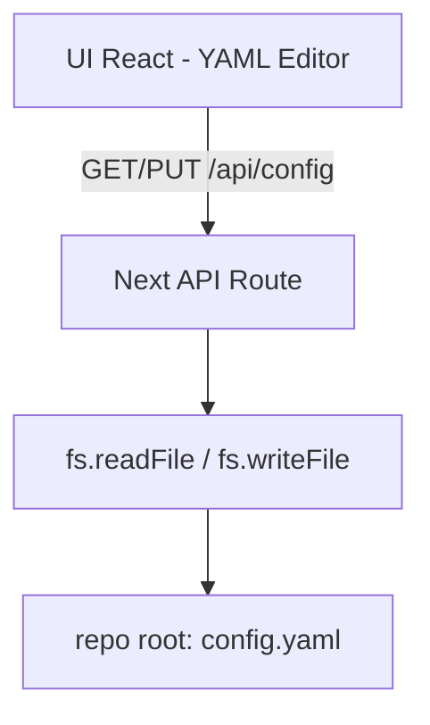

### Config Editor Web App

Application Next.js dédiée pour éditer `config.yaml` de la GW, séparée du runtime.



- Lancement: `pnpm -C web/config-editor dev`
- Endpoints:
  - GET `/api/config` → retourne `{ yaml }`
  - PUT `/api/config` body `{ yaml }` → valide YAML et sauvegarde

### Schéma YAML (extraits)

```yaml
pages:
  - name: "Voicemeeter+QLC"
    lcd:
      # 8 labels, support de la 2e ligne via un saut de ligne (\n)
      labels: ["Mic\nBaba", "Mic\nMath", "Mic\nJu", "Son\nMac", "Son\nPC", "Son\nMASTER", "Son\nRetours", "Lum\nFace"]
      # Couleurs par strip (0..7): 0=off, 1=red, 2=green, 3=yellow, 4=blue, 5=magenta, 6=cyan, 7=white
      colors: [2,2,2,4,4,7,3,6]
```


