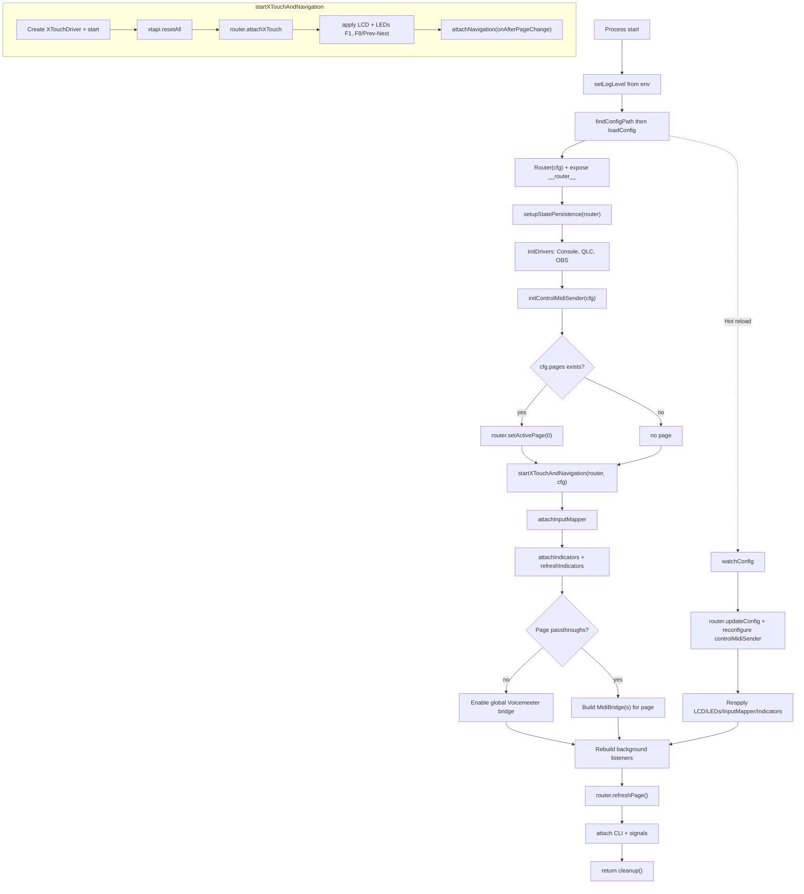
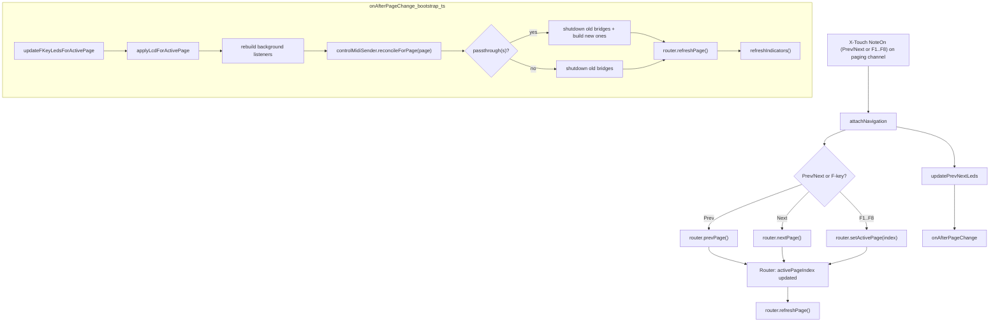
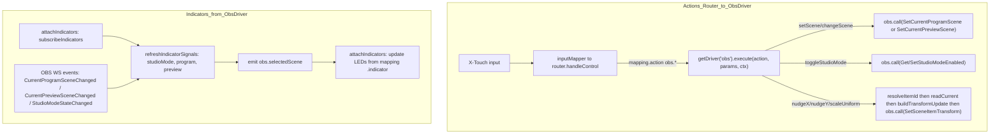
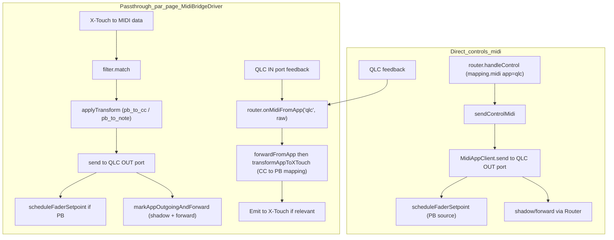

## Schémas de flux (Mermaid)

Ces schémas résument les flux principaux de l’application. Ils sont dérivés du code actuel (`src/app.ts`, `src/app/bootstrap.ts`, `src/app/navigation.ts`, `src/router.ts`, `src/router/page.ts`, `src/drivers/*`, `src/services/controlMidiSender.ts`).

### Démarrage de l'application

### Changement de page

### Flux OBS (actions + indicateurs)

### Flux QLC+ (passthrough et envoi direct MIDI)

