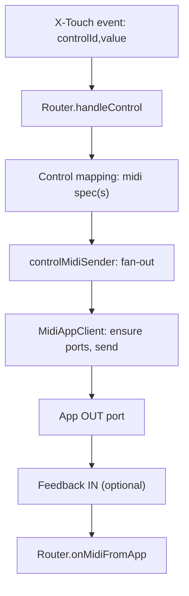

## Étude — Multi‑messages par contrôle (buttons, faders, etc.)

### Objectif
Permettre à un même contrôle logique (`button`, `fader`, `encoder`, etc.) d’émettre plusieurs messages MIDI vers une même app (ou plusieurs), de manière séquentielle et/ou conditionnelle (press/release, seuils, mapping valeur), tout en restant rétro‑compatible avec la configuration actuelle `controls.*.midi`.

### Faisabilité
- Rétro‑compatibilité: élevée. Autoriser `midi` à accepter soit un objet (spéc actuel), soit un tableau d’objets. Aucun breaking change requis côté YAML si l’on étend le type.
- Complexité technique: modérée. Le service `controlMidiSender` délègue déjà à `MidiAppClient`; il peut itérer sur un tableau et gérer l’ordre/les timings.
- Perfs/latence: impact négligeable si envoi synchrone (quelques messages). Prévoir option de délai par message pour les séquences.
- Tests: ajout de cas unitaires ciblant l’ordre d’envoi, la conversion PB→CC par message, press/release.

### Impacts
- Types TS (`src/types.ts`):
  - `ControlMidiSpec` inchangé.
  - `ControlMapping.midi`: élargir à `ControlMidiSpec | ControlMidiSpec[] | MultiMidiSpec` (forme avancée avec conditions/délais).
- Envoi (`src/services/controlMidiSender.ts` + `src/midi/appClient/*`):
  - Support des tableaux (itération ordonnée, await/sequence).
  - Optionnel: support d’un champ `delayMs` par message.
- Router/input (`src/router.ts`, `src/xtouch/inputMapper.ts`):
  - Aucun changement majeur: `router.handleControl(id, value)` reste l’API; le sender gère le fan‑out.
- Config YAML / UI (web/config-editor):
  - YAML: autoriser `midi: [{...}, {...}]`.
  - Éditeur: champ multi‑entrées, réordonnable; validation.
- Docs/tests: cas press/release; fader PB (14b) → multi‑CC; « passthrough » multi‑frames si utile.

### Schéma (Mermaid)


### Design proposé
- Forme simple (recommandée):
  - `midi` accepte `ControlMidiSpec | ControlMidiSpec[]`.
  - En cas de tableau, les messages sont envoyés dans l’ordre, sans délai, avec la même `value` brute passée au handler.
- Forme avancée (optionnelle, extensible sans implémentation immédiate):
  - `midi: { sequence: ControlMidiSpec[], on: "press|release|any", delayMs?: number, map?: {...} }`.
  - `map` permet d’écraser la valeur par message (constante, scaling, clamp).

### Exemples YAML (rétro‑compatibles)
```yaml
controls:
  button1:
    app: "qlc"
    midi:
      - { type: "note", channel: 1, note: 10 }   # press/release: 127 / 0
      - { type: "cc",   channel: 1, cc: 81 }     # renfort CC

  fader1:
    app: "qlc"
    midi:
      - { type: "cc", channel: 1, cc: 81 }
      - { type: "cc", channel: 1, cc: 82 }
```

### Plan d’implémentation
1) Types/config
   - Étendre `ControlMapping.midi` pour accepter un tableau.
   - Validation de config (optionnelle): normaliser vers `ControlMidiSpec[]` côté runtime.
2) Envoi
   - `sendControlMidi(app, specOrArray, value)`: fan‑out séquentiel, await par message.
   - Conversion PB→CC et règles existantes réutilisées par message.
3) Input/Router
   - Aucun changement (API identique). Conserver conventions press/release.
4) UI/Docs
   - Éditeur: UI multi‑entrées; aide YAML; mise à jour `docs/`.
5) Tests
   - Unitaires: ordre d’envoi, press/release, PB14→CC7b multi‑messages, erreurs par message (best‑effort next).
   - Intégration: séquence bouton et fader avec doubles CC.

### Étapes détaillées
- Étape 1: Types TS et normalisation (petit)
- Étape 2: `controlMidiSender.send()` — accepter tableau et boucler (moyen)
- Étape 3: Tests unitaires `services/controlMidiSender` et `midi/appClient` (petit)
- Étape 4: MEP YAML + docs + exemples (petit)
- Étape 5 (optionnel): UI multi‑entrées dans `web/config-editor` (moyen)

### Risques & atténuations
- Conflit avec passthroughs existants: conserver la même logique de gating des ports (priorité au passthrough).
- Latence perçue: négligeable; éviter des délais par défaut; proposer `delayMs` explicite si besoin.
- Répétition de feedback indésirable: anti‑echo déjà en place côté Router; inchangé.


