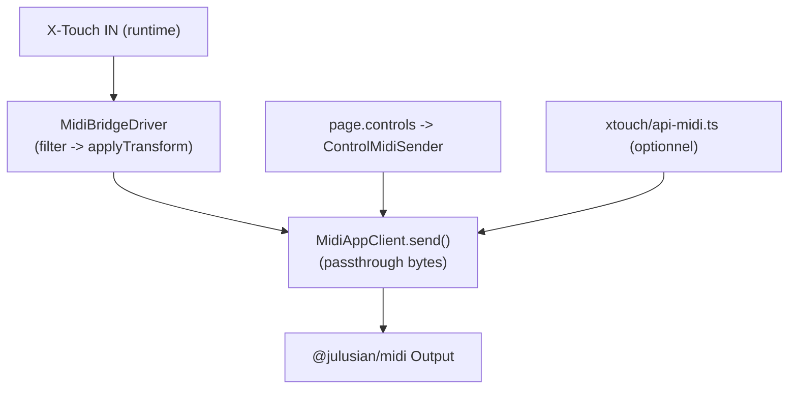
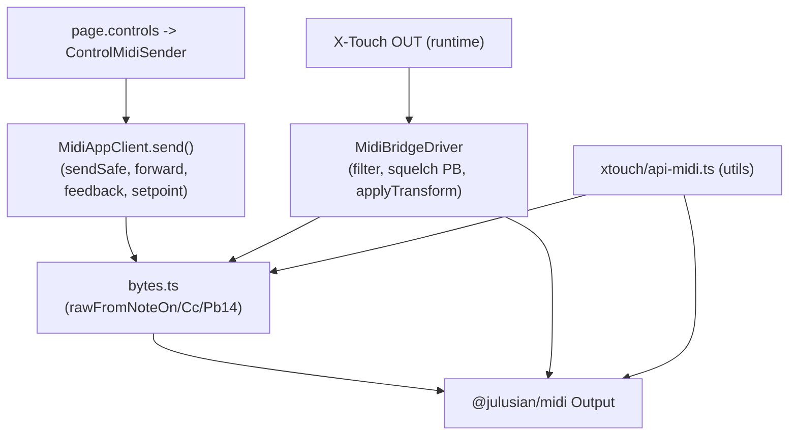

### Step-by-step (WIP)

- [x] Créer la branche `refactor/midi-send-unify` (2025-08-26)
- [x] Introduire `src/midi/convert.ts` (helpers 14b↔7b/8b/%/normalized, réexport `pb14FromRaw`/`rawFromPb14`) + tests
- [x] Introduire `src/midi/bytes.ts` (rawFromNoteOn/Cc/Pb14/NoteOff, clamp) + tests
- [x] Remplacer les conversions locales dans `midi/transform.ts` par `convert.ts`
- [x] Exposer `MidiAppClient.sendRaw(appKey, bytes)` (ou `type: "passthrough"`) et tracer sendSafe/forward/feedback/setpoints
- [x] Dans `drivers/midibridge`, remplacer l'envoi direct par délégation à `MidiAppClient` (résolution appKey) — OUT seulement
- [x] Remplacer les constructions locales (Note/CC/PB) par `bytes.ts` dans `midi/appClient`, `router/emit`, `xtouch/api-midi`
- [x] `xtouch/valueOverlay.ts`: utiliser `convert.ts` pour percent/7b/8b (PB) et percent (CC)
- [ ] Option: `xtouch/api-midi.ts` délègue à l'orchestrateur si présent (DI)
- [ ] Tests intégration (parité frames, anti-loop PB, timing) et mise à jour `tests-audit.md`

Journal d'itération
1) Lot 1 — Conversions + Bytes (fait)
   - Cibles: `src/midi/convert.ts`, `src/midi/bytes.ts`, `src/midi/transform.ts` (usage `to7bitFrom14bit`)
   - Sorties: fonctions utilitaires + tests unitaires de bornes/arrondis/round-trips
2) Lot 2 — Orchestrateur OUT unique (fait)
   - Cibles: `midi/appClient` (API `sendRaw` ajoutée), `drivers/midibridge` (délégation OUT)
3) Lot 3 — Remplacements globaux + DI API utils (en cours)
   - Cibles: `xtouch/api-midi.ts` (DI optionnelle), `router/emit.ts` (fait), `xtouch/valueOverlay.ts` (fait)

## Refactor: Unifier la logique d'émission MIDI (Note/CC/PB)

Objectif: éliminer la duplication entre trois chemins d'émission MIDI et concentrer la construction des trames et les conversions dans un module commun, tout en préservant les effets de bord spécifiques (forward, feedback, anti‑echo, transform passthrough).

### Constat actuel

- xtouch/api-midi.ts
  - Fournit des helpers simples: sendNoteOn, sendControlChange, sendPitchBend14 (et resets).
  - Construit les bytes + clamp, envoie via RawSender.sendRawMessage.

- midi/appClient/index.ts (utilisé par page.controls via ControlMidiSender)
  - Reconstruit les mêmes bytes (Note/CC/PB) + clamp.
  - Effets de bord: sendSafe (reconnexion), markAppOutgoingAndForward, ensureFeedbackOpen, setpoint moteurs (faders) quand utile.

- drivers/midibridge/index.ts (passthrough page‑scopé)
  - Envoi brut avec reconnexion + filtrage + applyTransform (pb_to_cc/pb_to_note) + anti‑loop PB (squelch).
  - Construit/émet bytes localement (post‑transform).

Conséquence: duplication de la construction de trames (status/data), du clamp, et de certaines conversions 14b→7b pour CC.

### Architecture cible simplifiée (recommandée)

But: une seule implémentation d'envoi (orchestrateur), réutilisée par toutes les entrées.

- Orchestrateur unique: `MidiAppClient` (ou `MidiOrchestrator` si renommé) devient l'unique façade d'émission OUT.
- `drivers/midibridge` n'ouvre plus de port OUT directement; il:
  - résout la clé d'app depuis `(to_port, from_port)` (via `resolveAppKey()`),
  - applique `applyTransform` (si config),
  - et délègue l'émission à `MidiAppClient` avec `type: "passthrough"` (bytes bruts) pour préserver les effets de bord (forward/feedback/setpoints).
- `xtouch/api-midi.ts` reste un utilitaire de confort pour scripts/tests HIL; en interne, il peut déléguer à l'orchestrateur si disponible (DI) ou rester un wrapper raw (à documenter comme optionnel).

Avantages:
- Une seule source de vérité pour l'envoi et la reconnexion; effets de bord centralisés.
- Le bridge reste focalisé sur: filtre → transform → délégation.
- Contrôle cohérent des fenêtres anti‑echo/forward/feedback.

Inconvénients/risques:
- `MidiAppClient` doit savoir envoyer par clé d'app dérivée des ports du bridge (déjà possible via `resolveAppKey` et mapping `midi.apps`).
- Migration incrémentale: commencer OUT seulement (le bridge garde son IN et sa logique d'écoute).

#### Diagramme

#### Étapes de migration

1) Exposer dans `MidiAppClient` une méthode `sendRaw(appKey, bytes)` (ou réutiliser `type: "passthrough"`).
2) Dans `MidiBridgeDriver`, remplacer l'envoi direct par un appel `MidiAppClient` (résolution appKey via `resolveAppKey`).
3) Conserver l'ouverture IN/retry dans le bridge (écoute feedback). L'OUT est désormais gérée par l'orchestrateur.
4) Option: dans `xtouch/api-midi.ts`, ajouter un chemin DI pour déléguer à l'orchestrateur si présent.
5) Tests d'intégration: vérifier parité des frames, forward/feedback, anti‑loop PB, timing.

### Centraliser les conversions (14b↔7b, percent)

Problème: Les conversions apparaissent à plusieurs endroits (ex: `scale14to7` dans `midi/appClient`, pourcentages dans `xtouch/valueOverlay`, mappage 14b→7b dans `midi/transform`).

Actions:
- Introduire `src/midi/convert.ts` avec:
  - `to7bitFrom14bit(value14: number): number` (borné, arrondi sans artefact FP)
  - `to14bitFrom7bit(value7: number): number`
  - `toPercentFrom14bit(value14: number): number` (0..100)
  - `to8bitFrom14bit(value14: number): number` (0..255)
  - `toNormalizedFrom14bit(value14: number): number` (0..1)
  - `to14bitFromNormalized(normalized: number): number` (0..16383)
  - `to7bitFromNormalized(normalized: number): number` (0..127)
  - `pb14FromRaw(lsb, msb)` et `rawFromPb14(ch, value14)` réexportés depuis utils/bytes selon découpage
- Remplacer toutes les implémentations locales par ces helpers (appClient, valueOverlay, transform, etc.).
- Ajouter des tests unitaires + property-based (monotonicité, bornes, inverses là où applicable).

Occurrences connues à migrer (inventaire rapide):
- `src/midi/appClient/index.ts`
  - `scale14to7()` et usage pour CC (valeurs >127 mappées 14b→7b)
  - Construction PB: clamp 0..16383 puis LSB/MSB
- `src/midi/transform.ts`
  - PB→Note: `Math.round((value14 / 16383) * 127)`
  - PB→CC: `Math.round((value14 / 16383) * 127)`
- `src/xtouch/valueOverlay.ts`
  - PB→percent/7b/8b: `Math.round((value14 / 16383) * 100|127|255)`
  - 7b→percent/8b: `(v7/127) * 100|255`
- `src/midi/decoder.ts`
  - `normalized = value14 / 16383`
- `src/animations/wave.ts`
  - Génération sinusoïdale 14b (PB) et 7b (CC)
- `src/xtouch/api-midi.ts`, `src/router/emit.ts`, `src/xtouch/faderSetpoint.ts`, `src/xtouch/driver.ts`, `src/midi/testDsl.ts`
  - Clamps 14b et encodage LSB/MSB (utiliser `rawFromPb14` et helpers `convert.ts`)
- `src/midi/utils.ts`
  - `pb14FromRaw` / `rawFromPb14` (à réexporter ou déplacer selon découpage `bytes.ts`/`convert.ts`)

### Diagramme (flux simplifié)

### Migration et risques

- Risque de changement de timing: conserver l'ordonnancement existant Notes→CC→SysEx→PB.
- S'assurer que sendSafe/retry restent au bon endroit (appClient/bridge).
- Vérifier que les transformations restent strictement côté passthrough (pas dans appClient).

### Suivi

- Tâches liées dans TASKS.md et Trello.
- Ajouter un point dans tests-audit.md sur la couverture bytes.ts et les chemins d'émission.

