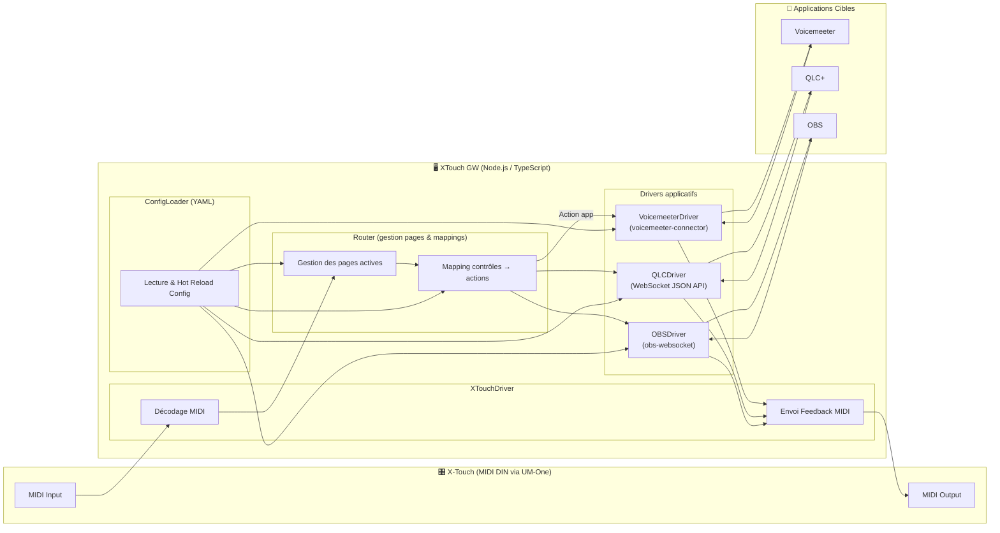
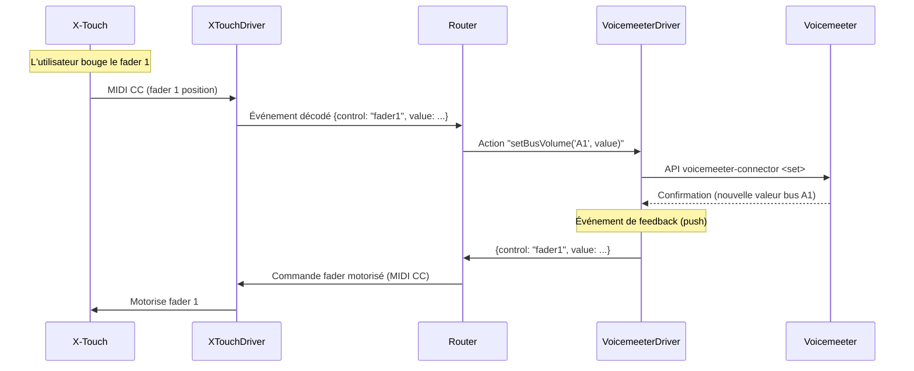
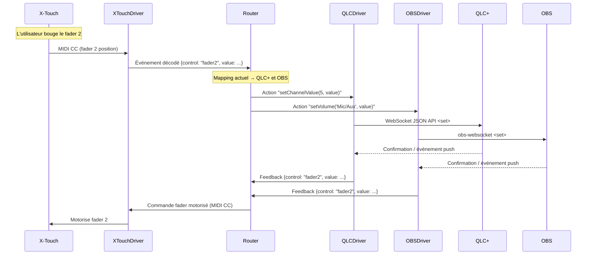

# **Documentation – XTouch GW**

## 1. **Présentation**

XTouch GW est une passerelle logicielle permettant de contrôler simultanément plusieurs applications (Voicemeeter, QLC+, OBS) à partir d’un contrôleur MIDI Behringer X-Touch.
Elle permet :

* Le mapping flexible des contrôles (faders, boutons, encodeurs, etc.) vers différentes applications.
* La gestion de pages (une page → une ou plusieurs applis).
* La synchronisation bidirectionnelle pour exploiter faders motorisés, LED et LCD.

---

## 2. **Architecture générale**



---

## 3. **Cycle de vie**

1. Chargement de la config YAML et initialisation des ports MIDI.
2. Connexion aux applications via leurs API respectives.
3. Sélection d’une page par défaut.
4. `sendInitialFeedback()` pour synchroniser la surface.
5. Écoute des événements MIDI et API en temps réel.
6. Hot reload de la config sur modification du fichier YAML.

---

## 4. **Format de configuration**

Exemple de fichier `config.yaml` :

```yaml
midi:
  input_port: "UM-One"
  output_port: "UM-One"

pages:
  - name: "Voicemeeter Main"
    controls:
      fader1: { app: "voicemeeter", action: "setBusVolume", params: ["A1"] }
      fader2: { app: "qlc", action: "setChannelValue", params: [5] }
      rotary1: { app: "obs", action: "setVolume", params: ["Mic/Aux"] }

  - name: "QLC Scene Control"
    controls:
      button1: { app: "qlc", action: "triggerCue", params: ["Scene1"] }
      button2: { app: "qlc", action: "triggerCue", params: ["Scene2"] }
```

---

## 5. **Séquences d’exécution**

### 5.1 Cas mono-application (fader → Voicemeeter)



### 5.2 Cas multi-applications (fader → QLC+ + OBS)



---

## 6. **Performance et contraintes**

* Latence visée : **< 20 ms** entre action et effet.
* Gestion des feedbacks en temps réel sans jitter.
* Hot reload de config sans interruption du flux.

Oui, tu as raison — dans la doc globale que je t’ai faite, on a surtout décrit l’architecture fonctionnelle et les flux, mais pas la **stack technique** ni les choix d’implémentation côté code.

On peut compléter la spec avec une section **Stack technique & choix d’implémentation** pour cadrer clairement :

---

## 7. **Stack technique**

### 7.1 Langage & runtime

* **Node.js** (LTS 20.x ou +)
* **TypeScript** (ES2022 target) pour :

  * Typage strict (interfaces pour les mappings, drivers, événements)
  * Compilation vers JS compatible Node LTS
  * Maintenabilité et évolutivité

### 7.2 Gestion MIDI

* **Bibliothèque** : [`midi`](https://www.npmjs.com/package/midi) ou [`easymidi`](https://www.npmjs.com/package/easymidi)
* Connexion **MIDI DIN** via interface Roland UM-One Mk2
* Ports spécifiés dans `config.yaml` (pas de détection auto dans la v1)
* Gestion bi-directionnelle :

  * **Entrée** : décodage des messages Control Change, Note On/Off, Pitch Bend, SysEx spécifiques X-Touch
  * **Sortie** : envoi de messages pour faders motorisés, LED rings, LCD text

### 7.3 Drivers applicatifs

* **VoicemeeterDriver** : [`voicemeeter-connector`](https://github.com/ChewbaccaCookie/voicemeeter-connector)

  * Écoute et envoi en temps réel (push events si dispo)
* **QLCDriver** : WebSocket JSON API de QLC+

  * Connexion persistante WebSocket → envoi direct des commandes
* **OBSDriver** : [`obs-websocket-js`](https://www.npmjs.com/package/obs-websocket-js)

  * Connexion TCP WebSocket → gestion volume, scènes, sources, etc.

### 7.4 Config & hot reload

* Format **YAML** : [`yaml`](https://www.npmjs.com/package/yaml)
* Surveillance fichier via [`chokidar`](https://www.npmjs.com/package/chokidar)
* Rechargement en live sans restart de la gateway

### 7.5 Architecture interne

* **Router** :

  * Centralise l’état (page active, mapping courant)
  * Découpe en modules : `Router`, `XTouchDriver`, `VoicemeeterDriver`, `QLCDriver`, `OBSDriver`
* **EventEmitter** interne pour propager les événements entre modules
* **Interfaces TypeScript** :

  ```ts
  interface ControlMapping {
    app: string;
    action: string;
    params?: any[];
  }

  interface Driver {
    init(): Promise<void>;
    sendInitialFeedback(): Promise<void>;
    handleControl(controlId: string, value: number): void;
  }
  ```

### 7.6 Gestion du feedback

* Priorité au **push** (écoute d’événements) pour latence minimale
* Fallback en **pull** (interval configurable, ex. 100 ms)
* Chaque driver implémente un `sendFeedback(controlId, value)` relayé au `XTouchDriver`

### 7.7 Performances & contraintes

* **Latence visée** : < 20 ms entrée → application et application → retour MIDI
* Traitement asynchrone non bloquant
* Pas de polling intensif inutile

Voici la version complétée de ta documentation avec les deux ajouts que tu voulais garder de l’ancienne base :

---

## 8. **Logger avec niveaux**

Un logger centralisé permettra de contrôler la verbosité de l’application selon l’environnement (dev/prod), tout en conservant un format homogène et lisible.

### 8.1 Niveaux

* `error` : erreurs bloquantes ou critiques.
* `warn` : anomalies non bloquantes.
* `info` : messages standards.
* `debug` : informations détaillées pour développement.
* `trace` : flux très verbeux, utile pour analyse fine.

### 8.2 Comportement

* Chaque message est préfixé par un **timestamp ISO**.
* Les niveaux sont filtrés selon `LOG_LEVEL` dans l’environnement.
* Couleurs distinctes pour chaque niveau via [`chalk`](https://www.npmjs.com/package/chalk).
* Facilement extensible vers un stockage fichier ou syslog.

**Exemple :**

```ts
logger.info("Initialisation de la gateway");
logger.debug("Message MIDI reçu", message);
logger.error("Connexion OBS échouée", err);
```

---

## 9. **Gestion et analyse des messages MIDI entrants**

Avant toute implémentation de mapping, la gateway doit savoir **exactement** quels messages la X-Touch envoie pour chaque contrôle.

### 9.1 Types de messages connus

* **Faders** : Pitch Bend 14 bits (0–16383), un canal par fader.
* **Rotary encoders** : Control Change (CC) valeurs relatives (+/-1…).
* **Boutons** : Note On / Note Off.
* **LED rings** : Control Change (valeur fixe pour position de LED).
* **LCD** : SysEx propriétaires X-Touch.
* **Jog wheel** : CC ou Note selon mode X-Touch.

### 9.2 Sniffer MIDI

Un mode debug permettra de :

* Capturer et afficher tous les messages MIDI bruts (hexadécimal + delta time).
* Identifier le **CC#, Note# et valeurs** pour chaque action physique.
* Alimenter automatiquement le fichier de mapping YAML.

**Exemple de log debug :**

```
2025-08-08T20:15:32.456Z [DEBUG] MIDI IN: b0 10 65 (Δ=0.003s)
```

### 9.3 Utilisation

* Activé par `LOG_LEVEL=debug` ou via un flag CLI (`--sniff`).
* Utile au démarrage du projet pour documenter tous les contrôles.
* Peut aussi servir en production pour diagnostic en cas de problème de mapping.
